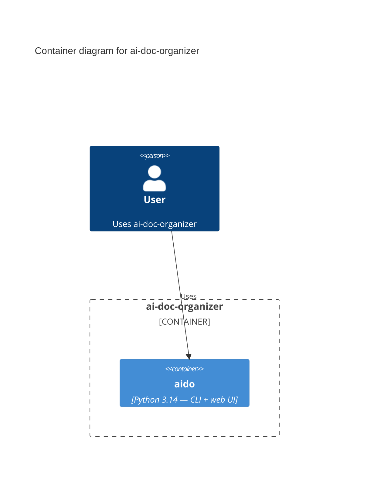

# Container Diagram

The deployable units that make up **ai-doc-organizer**, seeded from detected
structure. Each `Container(...)` entry follows the c4/v1 declared-container
shape (see ARCHITECTURE.md) so the maintenance pipeline can compare it against
the code. Refine labels, technologies, and relationships as needed.

