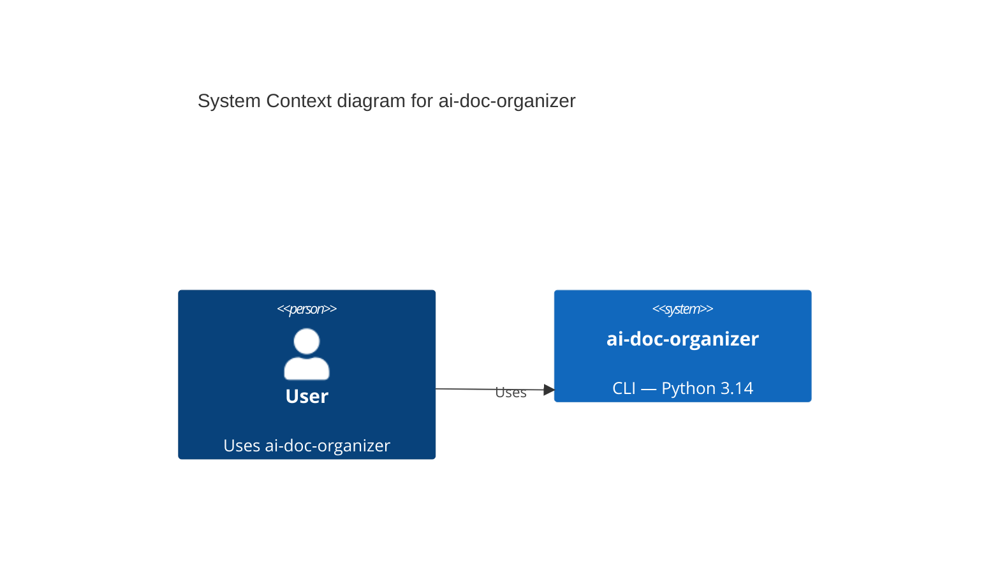

# System Context

The system context for **ai-doc-organizer** — who uses it and the systems it
talks to. Refine the actors and external systems as the architecture settles.

```mermaid
C4Context
    title System Context diagram for ai-doc-organizer

    Person(user, "User", "Uses ai-doc-organizer")
    System(ai-doc-organizer, "ai-doc-organizer", "CLI — Python 3.14")

    Rel(user, ai-doc-organizer, "Uses")
```
